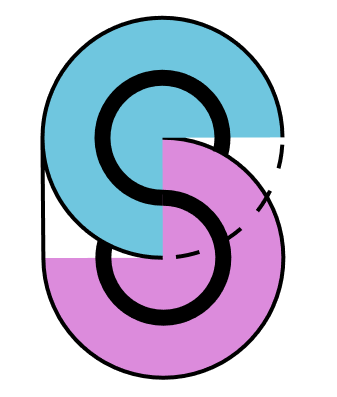
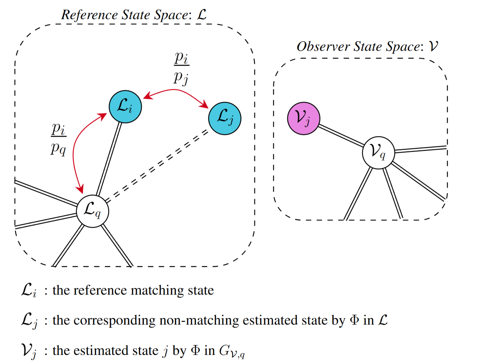
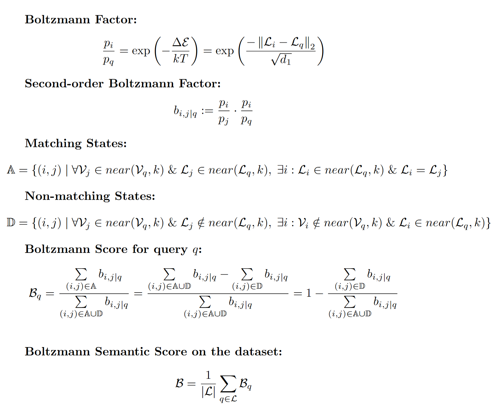

<h1 align="center">
  

  Boltzmann Semantic Score
</h1>
Official repository for:

**Boltzmann Semantic Score: A Semantic Metric for Evaluating Large Vision Models Using Large Language Models**  
_Ali Khajegili Mirabadi, Katherine Rich, Hossein Farahani, Ali Bashashati_  
_International Conference on Learning Representations (ICLR) 2025_

[📄 Paper ](https://openreview.net/pdf?id=9yJKTosUex)  
[📽️ ICLR Page (presentation + poster)](https://iclr.cc/virtual/2025/poster/30657)  


---

## 🔍 Overview

**Boltzmann Semantic Score (BSS)** is a novel metric for evaluating the **semantic alignment** between the representation spaces of Large Vision Models (LVMs) and Large Language Models (LLMs) using paired medical image-report datasets.

Unlike existing qualitative approaches, BSS offers a **quantitative**, **scalable**, and **expert-free** way to assess the semantic fidelity of LVMs.

---

## 🧠 Core Idea

For a dataset of paired images and medical reports:
- Use **LLMs** (or any proper text embedder) to create a structural representation of expert-written pathology reports
- Use **LVMs** to create an analogous structure from medical images
- Define **BSS** as the structural alignment between the two modalities using a new Boltzmann-based similarity measure

The theory of the Boltzmann semantic score is demonstrated as follows: 
<br>



<br>



---
## 📊 Highlights from the Paper

- ✅ Evaluated **5 LLMs** (e.g., Command-R, Bio-Llama3, Llama3, Gemma, Jamba)
- ✅ Evaluated **7 LVMs** (e.g., PLIP, UNI, CTransPath, Phikon, Swin, ViT, Lunit-Dino) using **BSS**.
- 📈 Found strong **correlation between BSS and downstream tasks** like retrieval accuracy and survival C-index

###  Why Use BSS?

- ✅ Scalable and model-agnostic
- ✅ No need for expert annotations or qualitative attention maps
- ✅ Quantifies semantic alignment between visual and textual spaces
- ✅ Applicable to any domain with paired image-text data (e.g., medical, industrial inspection)
---

## 💾 Dataset & Features

We use paired WSI images and pathology reports from **32 TCGA cancer types**, covering ~9,500 patients.

▶ Download Sample Precomputed Features:  
[LVM Feature Files (Google Drive)](https://drive.google.com/drive/folders/14Vw8pAsck-PlfcwbwRCl_EtE4lYqMtNJ?usp=sharing)

LLM features precomputed as a database dictionary can be found here: `./assets/generated_files/database/text/`

These include:
- `.pt` LLM embeddings of pathology reports as a dictionary 
- `.h5` LVM features from 7 vision models. When you downloaded them, place them in the dedicated directory in  `./assets/LVM`.
\
We are now releasing a small portion of the data. We will be releasing the LLM encodings of pathology reports soon. Please stay tuned!
---

## 🗂 Repository Structure

The directory is structured as follows:
<pre lang="markdown">Boltzmann/
    ├── boltzmann_semantic_score/   # Core code for computing the Boltzmann Semantic Score (BSS)
    ├── text_retrieval/             # Code for information retrieval tasks using LLM embeddings
    ├── assets/                     # Directory containing all input and output files
    │   ├── files/                  # Preprocessed inputs required to run the code
    │   └── generated_files/        # Outputs generated by running the code
    └── README.md                   # Project overview and documentation
</pre>

---

## ⚙️ Getting Started
### 0. Create the Conda environment
To run the code with the correct dependencies, use the provided YAML file to create a conda environment:

```bash
conda env create -f assets/files/cuda12_4.yaml
```
### 1. Clone the Repository

Clone the repository:

```bash
git clone https://github.com/AIMLab-UBC/Boltzmann.git
cd Boltzmann
```
### 2. Reproducing the Text Retrieval Experiment

To reproduce the LLM-based **text retrieval pipeline** described in the paper (only for a small sample set of TCGA-LGG and TCGA-GBM), run the following scripts in order:

```bash
1. ./text_retrieval/text_create_database.sh     # Step 1: Creates the encoded database of all LLM features (Note: we have provided the precomputed LLM database in `./assets/generated_files/database/text/`, so you do not need to run this step for the sake of testing the module. You should run this step in case you have the raw LLM features for each report, and you want to make the database instances directly.)
2. ./text_retrieval/text_search_eval.sh         # Step 2: Performs retrieval evaluation using the created database
3. ./text_retrieval/search_result_reporter.sh   # Step 3: Aggregates results into a final report format
```

### 3. Reproducing the Survival Prediction Experiment
Please follow the steps in 
```bash
 ./survival_module/run_batch.sh
```

### 4. Boltzmann Semantic Score Computation
To evaluate the semantic alignment between vision and language models using the **Boltzmann Semantic Score**, simply run (for the given toy datasets, you can choose between LGG or GBM):

```bash
bash ./boltzmann_semantic_score/vision_language_score_evaluator.sh
```

### Note: Following the feature structure for LVM and LLM, you can deploy the code for any other dataset!
---

## 📜 Citation

If you use this work, please cite:

```bibtex
@inproceedings{mirabadi2025boltzmann,
  title={Boltzmann Semantic Score: A Semantic Metric for Evaluating Large Vision Models Using Large Language Models},
  author={Ali Khajegili Mirabadi and Katherine Rich and Hossein Farahani and Ali Bashashati},
  booktitle={The Thirteenth International Conference on Learning Representations},
  year={2025},
  url={https://openreview.net/forum?id=9yJKTosUex}
}
```

